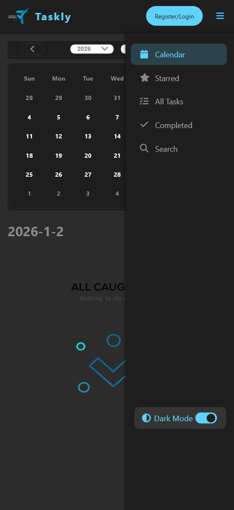
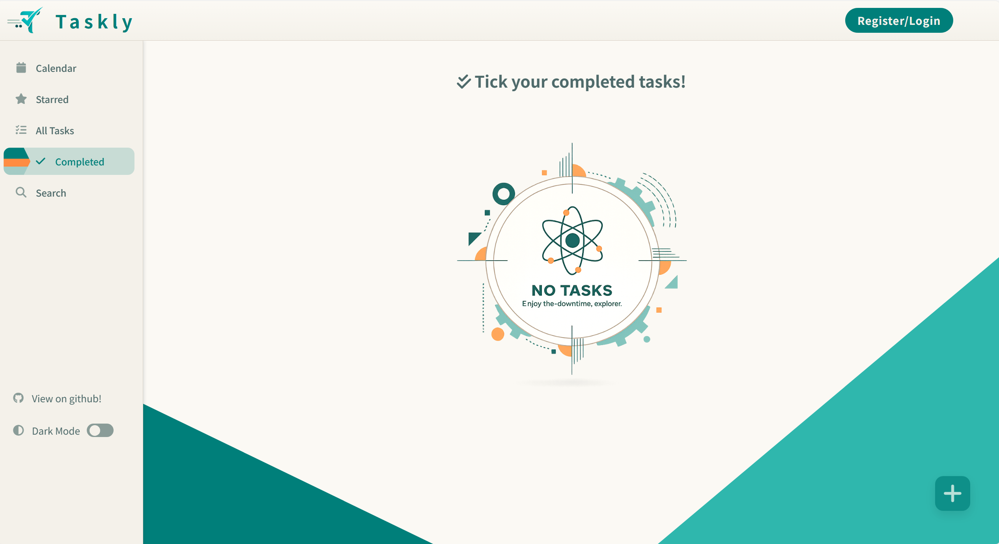

<div style="display: flex; align-items: center; justify-content: flex-start; gap: 1rem;">
    
    <span style="font-size: 3rem; font-weight: 700;"> Taskly </span>
</div>

**Taskly** is a responsive task management **single-page web application (SPA)** built with Vanilla JavaScript.  
It focuses on **state-driven UI updates**, **offline-first user experience**, **automatic data synchronization**, and **Retro-futuristic style and responsive UI design** with a lightweight backend service.

Live demo: https://taskly-gray-sigma.vercel.app

---

## Key Features

### User & Data Management

- User authentication (login / register)
- Persistent task storage using Supabase
- Offline-first experience using localStorage
- Automatic background synchronization when user actions occur

### Task Management

- Create, edit, and delete tasks
- Mark tasks as completed
- Star important tasks
- Keyword-based task search

### Interactive Calendar

- Month and year navigation
- Visual indicators for dates containing tasks
- Date-based task filtering

### Responsive UI & UX

- Fully responsive layout for desktop and mobile browsers
- Sidebar automatically collapses into a hamburger menu on small screens
- Adaptive task card layout for different screen sizes

### Custom UI Components

- Toggle switches (e.g. dark mode)
- Smooth animations and transitions for user feedback

---

## Tech Stack

- **Frontend:** HTML, CSS, Vanilla JavaScript
- **Build Tool:** Vite
- **Database / Backend:** Supabase (for data persistence and real-time updates)
- **Icons:** Font Awesome

<p align="start">
  
  
  
  
  
</p>

---

## Highlights and Key Learnings

- **Component-based design:** Gained experience in building modular, maintainable, and scalable components with clear separation of concerns.

* **Event-driven architecture:** Learned how to decouple state management and UI rendering using custom events, enabling multiple components to react to shared data changes.

* **Handling asynchronous data & local persistence:** Using local storage to enhance offline experience combined with user-action–driven synchronization to Supabase to reduce unnecessary network requests.

* **Responsive design**: Responsive design using `media query` and `css variables`, ensuring consistent user experience across desktop and mobile devices..

* **Smooth animations**: Using css `keyframe`, `tranform/transition` and js `requestAnimationFrame` to create smooth animations.

---

## Demo Screenshot

<div style="display: flex; justify-content: space-evenly; align-items: center; gap: 20px;">
    
    
</div>

## Installation & Running Locally:

1. **Clone the repository:**

```
git clone https://github.com/Emulisy/Taskly.git
cd Taskly
```

2. **Install dependencies:**

```
npm install
```

3. **Start the development server:**

```
npm run dev
```

4. **Open in browser:**

```
Open the URL shown in the terminal (usually `http://localhost:5173`).
```

> To expose the server to your local network, run:
>
> ```
> npm run dev -- --host
> ```

---

## License

This project is MIT licensed.
